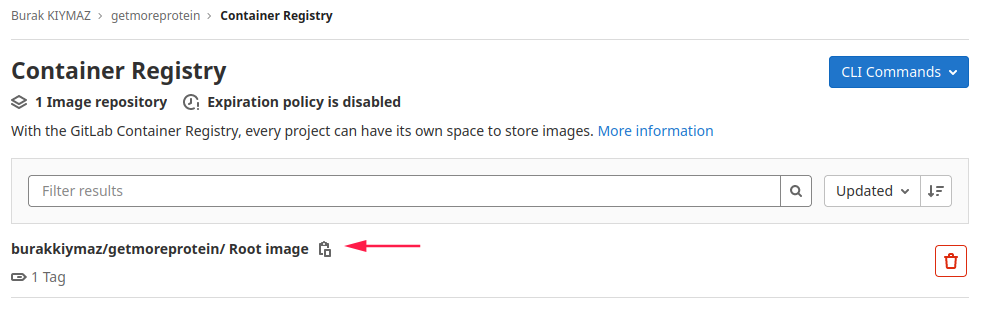

# GET MORE CLOUD!

In the application publishing just index page like below. It can be edit in `src/App.js` file.


To explain step by step what I did;
1. Install React framework in PC
    - [Install Guide](https://github.com/facebook/create-react-app)
    - `npm init getmoreprotein` for createing brand new application
    - `cd getmoreprotein` go inside project folder
    - `npm start` to run your basic website
    - Open <http://localhost:3000> to view website

2. If everything is OK in development we can containerize it with Docker
    - Create a file named `Dockerfile` in project folder.
    - `FROM node:latest` used official node image developed on fully hardened distribution which named alpine.
    - `WORKDIR /usr/src/app` going inside our application directory
    - `COPY package*.json ./` copying package.json and package-lock.json in application directory. This step is important because always we wants to contain same packeges in the container as in our local.
    - `RUN npm install` installing npm inside container
    - `COPY . ./` copying our all of project files to container. 
    - `EXPOSE 3000` making accessible 3000 port while container running. 
    - `CMD [ "npm", "start" ]` Finally running application.. 
    - Build image with this command: 
        ```bash
        $ docker build -t getmoreprotein:v1.0 getmoreprotein:latest .
        ```
    - We can run following Docker command to list the images created along with your ReactJS app image.
        ```bash
        $ docker images
        ```
    - Finally run the following command to run ReactJS App in the Docker container

        ```bash
        docker run -d -it  -p 3000:3000 --name getmoreprotein getmoreprotein:latest
        ```
    - Open <http://localhost:3000> to view website

3. Now its time to create CI/CD pipelines on GitLab
    - Firstly testing our code can build succesfully?
        ```yaml
        build:
            stage: build
            image: node
            script:
                - echo "Start building App"
                - npm install
                - echo "Build successfully!"
            artifacts:
                expire_in: 1 hour
                paths:
                - node_modules/
        ```
        - Application test part. It npm runs test cases in src/App.test.js for application testing. 
        ```yaml
        test:
            stage: test
            image: node
            script:
                - echo "Testing App"
                - CI=true npm test
                - echo "Test successfully!"
        ```
    - Building image with docker. If this step completed successfully, you can find it out your image in Container registry tab in GitLab.
        ```yaml
        docker-build:
            stage: docker-build
            image: docker:latest
            services:
                - name: docker:19.03.8-dind
            before_script:
                - docker login -u "$CI_REGISTRY_USER" -p "$CI_REGISTRY_PASSWORD" $CI_REGISTRY
            script:
                - docker build --pull -t "$CI_REGISTRY_IMAGE" .
                - docker push "$CI_REGISTRY_IMAGE"
        ```
        

    - Its time to deploy image in aws. It automatically connect my aws account because I added to GitLab secrets which are aws required to authenticate. 

    ```yaml
    publish:
        stage: deploy
        image:
            name: docker:latest
        services:
            - docker:19-dind
        before_script:
            - apk add --no-cache curl jq python3 py3-pip
            - pip install awscli
            - aws ecr get-login-password | docker login --username AWS --password-stdin $DOCKER_REGISTRY
            - aws --version
            - docker info
            - docker --version
        script:
            - docker build -t $DOCKER_REGISTRY/$APP_NAME:$CI_PIPELINE_IID .
            - docker push $DOCKER_REGISTRY/$APP_NAME:$CI_PIPELINE_IID
    ```
    

    - Writing some information about where application deploy in aws. 
        ```yaml
        variables:
            DOCKER_REGISTRY: 912961757140.dkr.ecr.eu-central-1.amazonaws.com #ECR URL
            AWS_DEFAULT_REGION: eu-central-1 #AWS region
            APP_NAME: getmoreprotein 
            DOCKER_HOST: tcp://docker:2375 #This will allow us to use the service docker:19-dind. Means that we use Docker in Docker to log in AWS in the before_script part.
            DOCKER_DRIVER: overlay2
            DOCKER_TLS_CERTDIR: ""
        ``` 
    - You can run pipelines or check previous pipeline status in `CI/CD -> Pipelines` tab
        

4. After successfully pipeline in GitLab we can find our tested image in AWS ECR. 
    
    - For publish my image on public, I used a Fargate cluster in ECS.
    - I created a new Cluster named 'getmoreprotein-cluster' in ECS (with Network Only template)
    - With task definition I defined my container which is pushed GitLab to my ECR. 
    - For using load balancer we need to configure a service. In services tab, I configred a new service definition. 
    - While creating new service definition, we can create some type of load-balancers. I selected Application Load-balancer because I need to run my application less downtime. If we needed speed or more availability, we would use Network loadbalancer.  
        
        
        
        
    - In my service autoscale configuration, it will run 2 tasks desired and minimum 2 task and maximum 4 tasks will run. You can find details of my service below. 
        
        
        
        

    - End of theese configurations, my application was accessible from internet with [loadbalancer address](http://EC2Co-EcsEl-1KOZW3OACCV75-1523123303.eu-central-1.elb.amazonaws.com).  
 

